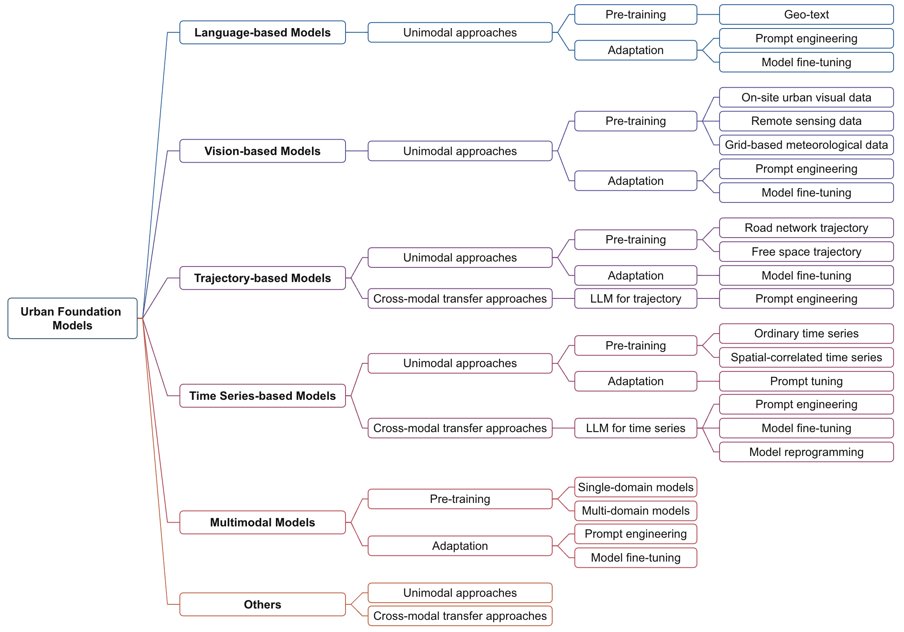

# Awesome-Urban-Foundation-Models
An Awesome Collection of Urban Foundation Models (UFMs).

<p align="center">


</p>


## Outline
- [Awesome-Urban-Foundation-Models](#awesome-urban-foundation-models)
  - [Outline](#outline)
  - [1-Language-based Models](#1-language-based-models)
    - [Unimodal Approaches](#unimodal-approaches)
      - [Pre-training](#pre-training)
      - [Adaptation](#adaptation)
  - [2-Vision-based Models](#2-vision-based-models)
    - [Unimodal Approaches](#unimodal-approaches-1)
      - [Pre-training](#pre-training-1)
      - [Adaptation](#adaptation-1)
  - [3-Trajectory-based Models](#3-trajectory-based-models)
    - [Unimodal Approaches](#unimodal-approaches-2)
      - [Pre-training](#pre-training-2)
      - [Adaptation](#adaptation-2)
    - [Cross-modal Transfer Approaches](#cross-modal-transfer-approaches)
  - [4-Time Series-based Models](#4-time-series-based-models)
    - [Unimodal Approaches](#unimodal-approaches-3)
      - [Pre-training](#pre-training-3)
      - [Adaptation](#adaptation-3)
    - [Cross-modal Transfer Approaches](#cross-modal-transfer-approaches-1)
  - [5-Multimodal-based Models](#5-multimodal-based-models)
    - [Pre-training](#pre-training-4)
    - [Adaptation](#adaptation-4)
  - [6-Others](#6-others)
    - [Unimodal Approaches](#unimodal-approaches-4)
    - [Cross-modal Transfer Approaches](#cross-modal-transfer-approaches-2)
  - [7-Citation](#7-citation)
  - [8-Contributing](#8-contributing)




## 1-Language-based Models

### Unimodal Approaches
#### Pre-training
**Geo-text**
- (*SIGIR'22*) MGeo: Multi-Modal Geographic Language Model Pre-Training [[paper](https://dl.acm.org/doi/abs/10.1145/3539618.3591728)]
- (*KDD'22*) ERNIE-GeoL: A Geography-and-Language Pre-trained Model and its Applications in Baidu Maps [[paper](https://dl.acm.org/doi/pdf/10.1145/3534678.3539021)]

#### Adaptation
**Prompt engineering**
- (*GIScience'23*) Evaluating the Effectiveness of Large Language Models in Representing Textual Descriptions of Geometry and Spatial Relations [[paper](https://arxiv.org/abs/2307.03678)]
- (*SIGSPATIAL'23*) Are Large Language Models Geospatially Knowledgeable? [[paper](https://dl.acm.org/doi/abs/10.1145/3589132.3625625)]
- (*arXiv 2023.05*) Towards Human-AI Collaborative Urban Science Research Enabled by Pre-trained Large Language Models [[paper](https://arxiv.org/abs/2305.11418)]
- (*arXiv 2023.05*) GPT4GEO: How a Language Model Sees the World's Geography [[paper](https://arxiv.org/abs/2306.00020)]

**Model fine-tuning**
- (*NeurIPS'23*) SAMRS: Scaling-up Remote Sensing Segmentation Dataset with Segment Anything Model [[paper](https://arxiv.org/abs/2305.02034)]
- (*arXiv 2023.04*) Segment Anything [[paper](https://arxiv.org/abs/2304.02643)]


## 2-Vision-based Models
### Unimodal Approaches
#### Pre-training
**On-site urban visual data**
- (*NeurIPS'23*) SAMRS: Scaling-up Remote Sensing Segmentation Dataset with Segment Anything Model [[paper](https://arxiv.org/abs/2305.02034)]
- (*arXiv 2023.04*) Segment Anything [[paper](https://arxiv.org/abs/2304.02643)]

**Remote sensing data**
- (*NeurIPS'23*) SAMRS: Scaling-up Remote Sensing Segmentation Dataset with Segment Anything Model [[paper](https://arxiv.org/abs/2305.02034)]
- (*arXiv 2023.04*) Segment Anything [[paper](https://arxiv.org/abs/2304.02643)]

**Grid-based meteorological data**
- (*NeurIPS'23*) SAMRS: Scaling-up Remote Sensing Segmentation Dataset with Segment Anything Model [[paper](https://arxiv.org/abs/2305.02034)]
- (*arXiv 2023.04*) Segment Anything [[paper](https://arxiv.org/abs/2304.02643)]

#### Adaptation
**Prompt engineering**
- (*NeurIPS'23*) SAMRS: Scaling-up Remote Sensing Segmentation Dataset with Segment Anything Model [[paper](https://arxiv.org/abs/2305.02034)]
- (*arXiv 2023.04*) Segment Anything [[paper](https://arxiv.org/abs/2304.02643)]

**Model fine-tuning**
- (*NeurIPS'23*) SAMRS: Scaling-up Remote Sensing Segmentation Dataset with Segment Anything Model [[paper](https://arxiv.org/abs/2305.02034)]
- (*arXiv 2023.04*) Segment Anything [[paper](https://arxiv.org/abs/2304.02643)]


## 3-Trajectory-based Models
### Unimodal Approaches
#### Pre-training
**Road network trajectory**
- (*ICDE'18*) Deep representation learning for trajectory similarity computation [[paper](https://doi.org/10.1109/ICDE.2018.00062)]
- (*IJCNN'17*) Trajectory clustering via deep representation learning [[paper](https://doi.org/10.1109/IJCNN.2017.7966345)]
- (*TIST'20*) Trembr: Exploring road networks for trajectory representation learning [[paper](https://doi.org/10.1145/3361741)]
- (*CIKM'21*) Robust road network representation learning: When traffic patterns meet traveling semantics [[paper](https://doi.org/10.1145/3459637.3482293)]
- (*IJCAI'21*) Unsupervised path representation learning with curriculum negative sampling [[paper](https://www.ijcai.org/proceedings/2021/0452.pdf)]
- (*KDD'23*) Lightpath: Lightweight and scalable path representation learning [[paper](https://doi.org/10.1145/3580305.3599415)]
- (*ICDM'23*) Self-supervised Pre-training for Robust and Generic Spatial-Temporal Representations [[paper](https://users.wpi.edu/~yli15/Includes/23_ICDM_MingzhiCR.pdf)]
- (*TKDE'23*) Pre-Training General Trajectory Embeddings With Maximum Multi-View Entropy Coding [[paper](https://doi.org/10.1109/TKDE.2023.3347513)]
- (*VLDB'22*) Unified route representation learning for multi-modal transportation recommendation with spatiotemporal pre-training [[paper](https://doi.org/10.1007/s00778-022-00748-y)]
- (*ICDE'23*) Self-supervised trajectory representation learning with temporal regularities and travel semantics [[paper](https://doi.org/10.1109/ICDE55515.2023.00070)]

**Free space trajectory**
- (*KDD'20*) Learning to simulate human mobility [[paper](https://doi.org/10.1145/3394486.3412862)]
- (*KBS'21*) Self-supervised human mobility learning for next location prediction and trajectory classification [[paper](https://doi.org/10.1016/j.knosys.2021.107214)]
- (*AAAI'21*) Pre-training context and time aware location embeddings from spatial-temporal trajectories for user next location prediction [[paper](https://doi.org/10.1609/aaai.v35i5.16548)]
- (*AAAI'23*) Contrastive pre-training with adversarial perturbations for check-in sequence representation learning [[paper](https://doi.org/10.1609/aaai.v37i4.25546)]

#### Adaptation
**Model fine-tuning**
- (*ToW'23*) Pre-Training Across Different Cities for Next POI Recommendation [[paper](https://doi.org/10.1145/3605554)]
- (*CIKM'21*) Region invariant normalizing flows for mobility transfer [[paper](https://doi.org/10.1145/3459637.3482169)]
- (*TIST'23*) Doing more with less: overcoming data scarcity for poi recommendation via cross-region transfer [[paper](https://doi.org/10.1145/3511711)]

### Cross-modal Transfer Approaches
**Prompt engineering**
- (*SIGSPATIAL'22*) Leveraging language foundation models for human mobility forecasting [[paper](https://doi.org/10.1145/3557915.3561026)]
- (*arXiv 2023.08*) Where would i go next? large language models as human mobility predictors [[paper](https://arxiv.org/abs/2308.15197)]
- (*arXiv 2023.10*) Large Language Models for Spatial Trajectory Patterns Mining [[paper](https://arxiv.org/abs/2310.04942)]
- (*arXiv 2023.11*) Exploring Large Language Models for Human Mobility Prediction under Public Events [[paper](https://arxiv.org/abs/2311.17351)]
- (*arXiv 2023.09*) Can you text what is happening? Integrating pre-trained language encoders into trajectory prediction models for autonomous driving [[paper](https://arxiv.org/abs/2309.05282)]
- (*arXiv 2023.10*) Gpt-driver: Learning to drive with gpt [[paper](https://arxiv.org/abs/2310.01415)]
- (*arXiv 2023.10*) Languagempc: Large language models as decision makers for autonomous driving [[paper](https://arxiv.org/abs/2310.03026)]


## 4-Time Series-based Models
### Unimodal Approaches
#### Pre-training
**Ordinary time series**
- (*NeurIPS'23*) SAMRS: Scaling-up Remote Sensing Segmentation Dataset with Segment Anything Model [[paper](https://arxiv.org/abs/2305.02034)]
- (*arXiv 2023.04*) Segment Anything [[paper](https://arxiv.org/abs/2304.02643)]

**Spatial-correlated time series**
- (*NeurIPS'23*) SAMRS: Scaling-up Remote Sensing Segmentation Dataset with Segment Anything Model [[paper](https://arxiv.org/abs/2305.02034)]
- (*arXiv 2023.04*) Segment Anything [[paper](https://arxiv.org/abs/2304.02643)]

#### Adaptation
**Prompt tuning**
- (*NeurIPS'23*) SAMRS: Scaling-up Remote Sensing Segmentation Dataset with Segment Anything Model [[paper](https://arxiv.org/abs/2305.02034)]
- (*arXiv 2023.04*) Segment Anything [[paper](https://arxiv.org/abs/2304.02643)]


### Cross-modal Transfer Approaches
**Prompt engineering**
- (*NeurIPS'23*) SAMRS: Scaling-up Remote Sensing Segmentation Dataset with Segment Anything Model [[paper](https://arxiv.org/abs/2305.02034)]
- (*arXiv 2023.04*) Segment Anything [[paper](https://arxiv.org/abs/2304.02643)]

**Model fine-tuning**
- (*NeurIPS'23*) SAMRS: Scaling-up Remote Sensing Segmentation Dataset with Segment Anything Model [[paper](https://arxiv.org/abs/2305.02034)]
- (*arXiv 2023.04*) Segment Anything [[paper](https://arxiv.org/abs/2304.02643)]

**Model reprogramming**
- (*NeurIPS'23*) SAMRS: Scaling-up Remote Sensing Segmentation Dataset with Segment Anything Model [[paper](https://arxiv.org/abs/2305.02034)]
- (*arXiv 2023.04*) Segment Anything [[paper](https://arxiv.org/abs/2304.02643)]


## 5-Multimodal-based Models
### Pre-training
**Single-domain models**
- (*NeurIPS'23*) SAMRS: Scaling-up Remote Sensing Segmentation Dataset with Segment Anything Model [[paper](https://arxiv.org/abs/2305.02034)]
- (*arXiv 2023.04*) Segment Anything [[paper](https://arxiv.org/abs/2304.02643)]

**Multi-domain models**
- (*NeurIPS'23*) SAMRS: Scaling-up Remote Sensing Segmentation Dataset with Segment Anything Model [[paper](https://arxiv.org/abs/2305.02034)]
- (*arXiv 2023.04*) Segment Anything [[paper](https://arxiv.org/abs/2304.02643)]

### Adaptation
**Prompt engineering**
- (*NeurIPS'23*) SAMRS: Scaling-up Remote Sensing Segmentation Dataset with Segment Anything Model [[paper](https://arxiv.org/abs/2305.02034)]
- (*arXiv 2023.04*) Segment Anything [[paper](https://arxiv.org/abs/2304.02643)]

**Model fine-tuning**
- (*NeurIPS'23*) SAMRS: Scaling-up Remote Sensing Segmentation Dataset with Segment Anything Model [[paper](https://arxiv.org/abs/2305.02034)]
- (*arXiv 2023.04*) Segment Anything [[paper](https://arxiv.org/abs/2304.02643)]


## 6-Others
### Unimodal Approaches
- (*NeurIPS'23*) SAMRS: Scaling-up Remote Sensing Segmentation Dataset with Segment Anything Model [[paper](https://arxiv.org/abs/2305.02034)]
- (*arXiv 2023.04*) Segment Anything [[paper](https://arxiv.org/abs/2304.02643)]

### Cross-modal Transfer Approaches
- (*NeurIPS'23*) SAMRS: Scaling-up Remote Sensing Segmentation Dataset with Segment Anything Model [[paper](https://arxiv.org/abs/2305.02034)]
- (*arXiv 2023.04*) Segment Anything [[paper](https://arxiv.org/abs/2304.02643)]


## 7-Citation

If you find our paper useful, please kindly cite us via:
```

```


## 8-Contributing

👍 Contributions to this repository are welcome! 

If you have come across relevant resources, feel free to open an issue or submit a pull request.
```
- (*conference|journal*) paper_name [[pdf](link)][[code](link)]
```
